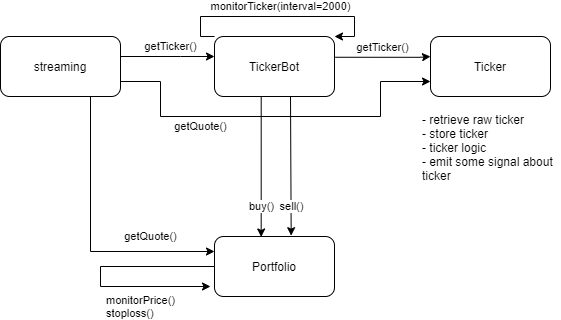

# Table of content
<details>
</details>

- [Diagram](#Diagram)
- [Install](#Install)
- [Usage](#Usage)
- [Libraries](#Libraries)
  - [Portfolio](##Portfolio)
  - [Line client](##Line-client)
- [To dos](#To-dos)
# Diagram


# Install
- clone this [project](https://github.com/niamin-niaman/streaming-wrapper-using-puppeteer) in same directory

```
\ root
| -- streaming-wrapper-using-puppeteer 
    | -- ...
| -- strategy-follow-buy-ticker ( currently use )
    | -- ...
    | -- app.js ( project file )
```
- install dependency in both directory 
```
    npm install
```
- edit `.env.example`
```
BROKER = 'broker'
USER_NAME = 'username'
PASSWORD = 'password'
```
- run script use
```
node app.js
```

# Usage


# Libraries

## Porfolio
### Usage
``` javascript
const portfolio = new Portfolio(1000) 
// initial portfolio with line available
```
### `portfolio.buy('symbol',volume,price)`
### `portfolio.sell('symbol',volume,price)`
### `portfolio.updateMktPrice('symbol',price)`
### `portfolio.getPortfolio()`
return array of object
``` javascript
// simulate buy 
portfolio.buy("NYT", 100, 3.53);
portfolio.updateMktPrice("NYT", 4.0);
portfolio.buy("SC", 100, 2.8);
portfolio.updateMktPrice("SC", 3.08);

let result = portfolio.getPorfolio()
// result = [
//   {
//     Symbol: 'NYT',
//     ActualVol: 100,
//     AvgCost: 3.53,
//     MktPrice: 4,
//     AmountCost: 353,
//     MarketValue: 400,
//     UnrealizedPL: 47,
//     PercentUnrealizedPL: 13.31
//   },
//   {
//     Symbol: 'SC',
//     ActualVol: 100,
//     AvgCost: 2.8,
//     MktPrice: 3.08,
//     AmountCost: 280,
//     MarketValue: 308,
//     UnrealizedPL: 28,
//     PercentUnrealizedPL: 10
//   }
// ]
``` 


## Line-client

# To-dos
* [ ] calculate bid offer [this](https://web.facebook.com/stockjournoey/posts/234161043821994?_rdc=1&_rdr) 
* [ ] store ticker into db ( mongodb )